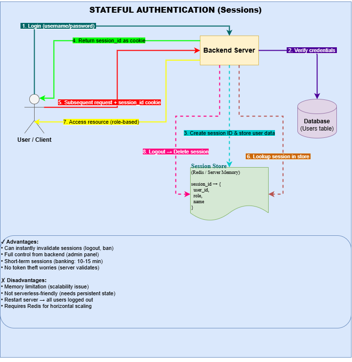

# 📌 Cookie-Based Session Authentication (Redis + Express + TypeScript)

A production-style authentication system implementing **stateful session authentication using Redis**, built to demonstrate how real backend systems maintain secure user sessions without JWT.

---

## ⚡ What this project actually proves

This project is not “just login/signup”.

It demonstrates:

* How **session-based authentication works internally (not abstractly)**
* How to persist authentication state using **Redis as a session store**
* How to securely store passwords using **bcrypt hashing**
* How to prevent **client-side token dependency (JWT-free auth model)**
* How backend systems maintain **server-controlled authentication state**

---

## 🧠 Real system architecture



```text id="sys1"
Client (Browser)
   |
   |  Cookie: connect.sid
   v
Express Server
   |
   |-- Session Middleware
   |-- Auth Logic (bcrypt)
   v
Redis Store
   |
   |-- sess:<sessionId>
   |-- { userId, cookie metadata }
```

👉 Key idea:
Authentication state is **NOT in the client**. It lives in Redis.

---

## 🔐 Core authentication flow (real behavior)

### 1. Signup

* Password is hashed using bcrypt (salted hashing)
* User stored in database (no plain text passwords ever)

### 2. Login

* Credentials validated
* bcrypt compares hashed password
* If valid:

  * Session created on server
  * Session ID generated
  * Stored in Redis
  * Sent to browser via HTTP-only cookie

### 3. Auth persistence

* Every request sends cookie automatically
* Server resolves session from Redis
* User is recognized without re-login

---

## 💥 What makes this different from basic tutorials

### ❌ Typical beginner approach

* Store token in localStorage
* Use JWT everywhere
* Stateless auth only

---

### ✅ This implementation

* Server-controlled sessions
* Redis-backed persistence
* No token exposure to client JS
* Session invalidation possible instantly
* More secure for web apps with cookies

---

## 🛠️ Tech decisions (why they matter)

| Tech            | Why it exists                  |
| --------------- | ------------------------------ |
| Express-session | Manages session lifecycle      |
| Redis           | Fast in-memory session storage |
| bcrypt          | Secure password hashing        |
| Sequelize       | Structured DB access           |
| TypeScript      | Prevent runtime auth bugs      |

---

## 🔍 Real impact features

### ✔ Secure authentication

Passwords are never stored or transmitted in plain text.

### ✔ Server-controlled login state

User sessions can be destroyed instantly (logout = delete Redis key).

### ✔ Scalable session storage

Redis allows horizontal scaling (no memory dependency on Node server).

### ✔ Production-style architecture

Separates concerns:

* auth logic
* session storage
* database layer

---

## 🍪 Session verification (debug flow)

To verify session is working:

```ts id="dbg1"
console.log(req.sessionID);
console.log(req.session);
```

In Redis:

```bash id="dbg2"
GET sess:<sessionID>
```

---

## 🚀 What you can extend next (real-world upgrades)

* 🔒 Role-based access control (admin/user)
* 🚪 Logout (session destroy in Redis)
* 🧠 Refresh session strategy
* ⚡ Rate limiting for login endpoints
* 📊 Session analytics (active users tracking)

---

## 🎯 Bottom line

This project is a working example of:

> **How real backend systems manage authentication state securely without exposing tokens to the client.**


